---
## Front matter
title: "Отчёт по лабораторной работе №3 "
subtitle: "Дисциплина: Операционные системы"
author: "Егорова Юлия Владимировна"

## Generic otions
lang: ru-RU
toc-title: "Содержание"

## Bibliography
bibliography: bib/cite.bib
csl: pandoc/csl/gost-r-7-0-5-2008-numeric.csl

## Pdf output format
toc: true # Table of contents
toc-depth: 2
lof: true # List of figures
lot: true # List of tables
fontsize: 12pt
linestretch: 1.5
papersize: a4
documentclass: scrreprt
## I18n polyglossia
polyglossia-lang:
  name: russian
  options:
	- spelling=modern
	- babelshorthands=true
polyglossia-otherlangs:
  name: english
## I18n babel
babel-lang: russian
babel-otherlangs: english
## Fonts
mainfont: PT Serif
romanfont: PT Serif
sansfont: PT Sans
monofont: PT Mono
mainfontoptions: Ligatures=TeX
romanfontoptions: Ligatures=TeX
sansfontoptions: Ligatures=TeX,Scale=MatchLowercase
monofontoptions: Scale=MatchLowercase,Scale=0.9
## Biblatex
biblatex: true
biblio-style: "gost-numeric"
biblatexoptions:
  - parentracker=true
  - backend=biber
  - hyperref=auto
  - language=auto
  - autolang=other*
  - citestyle=gost-numeric
## Pandoc-crossref LaTeX customization
figureTitle: "Рис."
tableTitle: "Таблица"
listingTitle: "Листинг"
lofTitle: "Список иллюстраций"
lotTitle: "Список таблиц"
lolTitle: "Листинги"
## Misc options
indent: true
header-includes:
  - \usepackage{indentfirst}
  - \usepackage{float} # keep figures where there are in the text
  - \floatplacement{figure}{H} # keep figures where there are in the text
---

# Цель работы

Изучить идеологию и применение средств контроля версий.

Освоить умения по работе с git.

# Задание

Создать базовую конфигурацию для работы с git.

Создать ключ SSH.

Создать ключ PGP.

Настроить подписи git.

Зарегистрироваться наGithub.

Создать локальный каталог для выполнения заданий по предмету.

# Выполнение лабораторной работы

1. Зададим имя и email владельца репозитория: (рис. [-@fig:001])

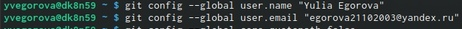{ #fig:001 width=70% }

2. Настроим utf-8 в выводе сообщений git: (рис. [-@fig:002])

{ #fig:002 width=70% }

3. Настроим верификацию и подписание коммитов git. Зададим имя начальной ветки (будем называть её master): (рис. [-@fig:003])

{ #fig:003 width=70% }

4. Введем параметр autocrlf: (рис. [-@fig:004])

{ #fig:004 width=70% }

5. Введем параметр safecrlf: (рис. [-@fig:005])

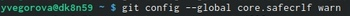{ #fig:005 width=70% }

6. Создаем ключи ssh. 

По алгоритму rsa с ключом размером 4096 бит: (рис. [-@fig:006])

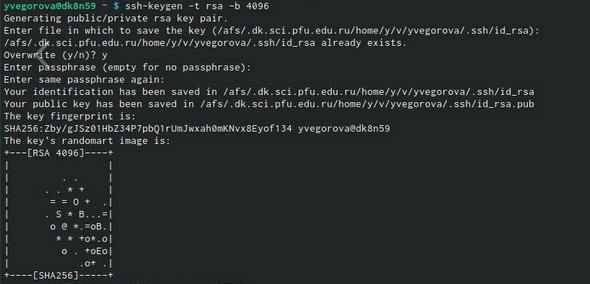{ #fig:006 width=70% }

По алгоритму ed25519: (рис. [-@fig:007])

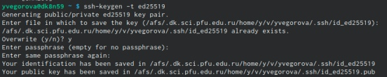{ #fig:007 width=70% }

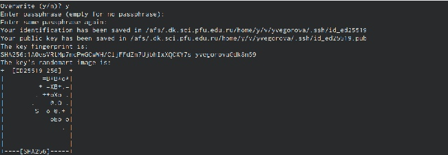{ #fig:008 width=70% }

7. Создаем ключи pgp.

Генерируем ключ.

Из предложенных опций выбираем: 

тип RSA and RSA;

размер 4096; 

срок действия; значение по умолчанию— 0 (срок действия не истекает никогда).

GPG запросит личную информацию, которая сохранится в ключе:

Имя (не менее 5 символов). 

Адрес электронной почты. 

При вводе email убедились, что он соответствует адресу, используемому на GitHub.

Комментарий. Можно ввести что угодно или нажать клавишу ввода, чтобы оставить это поле пустым.

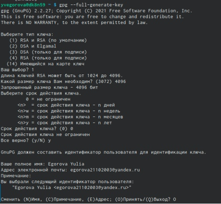{ #fig:009 width=70% }

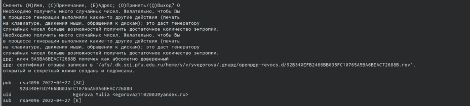{ #fig:010 width=70% }

8. Выводим список ключей и копируем отпечаток приватного ключа:

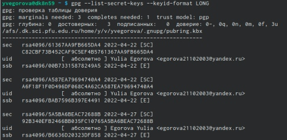{ #fig:011 width=70% }

9. Копируем сгенерированный PGP ключ в буфер обмена:

{ #fig:012 width=70% }

И переходим в настройки GitHub по ссылке, нажимаем на кнопку New GPG key и вставляем полученный ключ в поле ввода.

10. Используя введёный email, указываем Git и применить его при подписи коммитов:

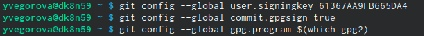{ #fig:013 width=70% }

11. Далее я создала шаблон рабочего пространства по примеру https://github.com/yamadharma/course-directory-student-template.

Создала каталог "Операционные системы" и перешла в него. Затем на Githab скопировала ссылку на свой репозиторий по шаблону и добавила ссылку в команду git clone --recursive. 

{ #fig:014 width=70% }

{ #fig:015 width=70% }

12. После этого я перешла в свой каталог и удалила лишние файлы.

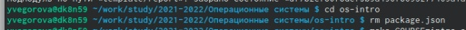{ #fig:016 width=70% }

13. Создала необходимые каталоги:

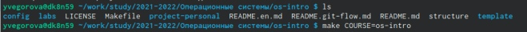{ #fig:017 width=70% }

14. И в конце отправила файлы на сервер:

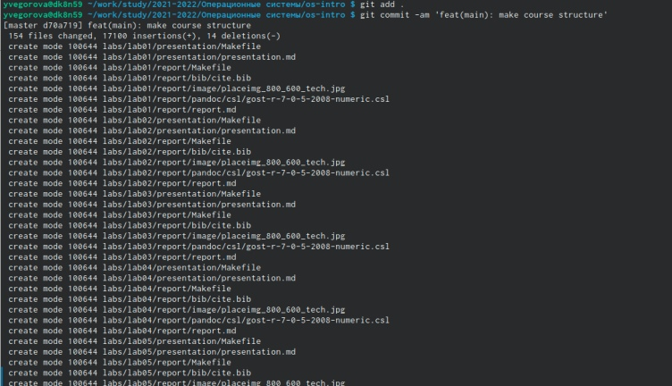{ #fig:018 width=70% }

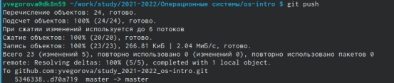{ #fig:019 width=70% }

#  Выводы

В ходе данной лабораторной работы я изучила идеологию и применение средств контроля версий. А также освоила умения по работе с git.

Контрольные вопросы:

1. Что такое системы контроля версий (VCS) и для решения каких задач они предназначаются?

Version Control System — это программное обеспечение для облегчения работы с изменяющейся информацией. Системы контроля версий (Version Control System, VCS) применяются при работе нескольких человек над одним проектом. Основное дерево проекта обычно хранится в локальном или удалённом репозитории, к которому настроен доступ для участников проекта. При внесении изменений в содержание проекта система контроля версий позволяет их фиксировать, совмещать изменения, произведённые разными участниками проекта, производить откат к любой более ранней версии проекта, если это требуется.

2. Объясните следующие понятия VCS и их отношения: хранилище, commit, история,рабочая копия.

В классических системах контроля версий используется централизованная модель, предполагающая наличие единого репозитория для хранения файлов. Выполнение большинства функций по управлению версиями осуществляется специальным сервером. Пользователь перед началом работы посредством определённых команд получает нужную ему версию файлов. После внесения изменений, пользователь размещает новую версию в хранилище. При этом предыдущие версии не удаляются из центрального хранилища и к ним можно вернуться в любой момент. Сервер может сохранять неполную версию изменённых файлов, а производить так называемую дельта-компрессию—сохранять только изменения между последовательными версиями, что позволяет уменьшить объём хранимых данных.
Системы контроля версий также могут обеспечивать дополнительные, более гибкие функциональные возможности: они могут поддерживать работу с несколькими версиями одного файла, сохраняя общую историю изменений до точки ветвления версий и собственные истории изменений каждой ветви. Более того, обычно доступна информация о том, кто из участников, когда и какие изменения вносил. Обычно такого рода информация хранится в журнале изменений, доступ к которому можно ограничить.

3. Что представляют собой и чем отличаются централизованные и децентрализованные VCS? Приведите примеры VCS каждого вида.

Централизованные системы — это системы, которые используют архитектуру клиент/сервер, где один или несколько клиентских узлов напрямую подключены к центральному серверу. Пример - Wikipedia.
В децентрализованных системах каждый узел принимает свое собственное решение. Конечное поведение системы является совокупностью решений отдельных узлов. Пример — Bitcoin.
В классических системах контроля версий используется централизованная модель, предполагающая наличие единого репозитория для хранения файлов. Выполнение большинства функций по управлению версиями осуществляется специальным сервером.

4. Опишите действия сVCS при единоличной работе с хранилищем

Создадим локальный репозиторий. Сначала сделаем предварительную конфигурацию, указав имя и email владельца репозитория:

git config —global user.name "Имя Фамилия"

git config —global user.email "work@mail"

И настроим utf-8 в выводе сообщенийgit:

git config —global quotepath false

Для инициализации локального репозитория, расположенного, например, в каталоге ~/tutorial, необходимо ввести в командной строке:

cd

mkdir tutorial

cd tutorial

git init.

5. Опишите порядок работы с общим хранилищем VCS.

Для последующей идентификации пользователя на сервере репозиториев необходимо сгенерировать пару ключей (приватный и открытый):

ssh-keygen -C "Имя Фамилия <work@mail>"

Ключи сохраняться в каталоге ~/.ssh/. Скопировав из локальной консоли ключ в буфер обмена: cat ~/.ssh/id_rsa.pub | xclip -sel clip, вставляем ключ в появившееся на сайте поле.

6. Каковы основные задачи,решаемые инструментальным средством git?

У Git две основных задачи: первая — хранить информацию о всех изменениях в вашем коде, начиная с самой первой строчки, а вторая — обеспечивать удобства командной работы над кодом.

7. Назовите и дайте краткую характеристику командам git.

Основные команды git:

1. **git init** – создание основного дерева репозитория.

2. **git pull** - получение обновлений текущего дерева из центрального репозитория.

3. **git push** – отправка всех произведённых изменений локального дерева в центральный репозиторий.

4. **git status** – просмотр списка изменённых файлов в текущей директории. 

5. **git diff** - просмотр текущих изменений. 

6. **git add** - добавить все изменённые и/или созданные файлы и/или каталоги.

7. **git add имена_файлов** - добавить конкретные изменённые и/или созданные файлы и/или каталоги.

8. **git rm имена_файлов** - удалить файл и/или каталог из индекса репозитория (при этом файл и/или каталог остаётся в локальной директории).

9. **git commit -am 'Описание коммита'** - сохранить все добавленные изменения и все изменённые файлы.

10. **git commit** - сохранить добавленные изменения с внесением комментария через встроенный редактор.

11. **git checkout -b имя_ветки** –создание новой ветки, базирующейся на текущей.

12. **git checkout имя_ветки** - переключение на некоторую ветку.

13. **git push origin имя_ветки** - отправка изменений конкретной ветки в центральный репозиторий.

14. **git merge --no-ff имя_ветки**- слияние ветки стекущим деревом.

15. **git branch -d имя_ветки** - удаление локальной уже слитой с основным деревом ветки.

16. **git branch -D имя_ветки** - принудительное удаление локальной ветки.

17. **git push origin :имя_ветки** - удаление ветки с центрального репозитория.

8. Приведите примеры использования при работе с локальным и удалённым репозиториями.

Использования git при работе с локальными репозиториями (добавления текстового документа в локальный репозиторий):

git add hello.txt

git commit -am' Новый файл.

9. Что такое и зачем могут быть нужны ветви (branches)?

Проблемы, которые решают ветки git:

• нужно постоянно создавать архивы с рабочим кодом.

• сложно "переключаться" между архивами.

• сложно перетаскивать изменения между архивами.

• легко что-то напутать или потерять.

10. Как и зачем можно игнорировать некоторые файлы при commit?

Во время работы над проектом так или иначе могут создаваться файлы, которые не требуется добавлять в последствии в репозиторий. Например, временные файлы, создаваемые редакторами, или объектные файлы, создаваемые компиляторами. Можно прописать шаблоны игнорируемых при добавлении в репозиторий типов файлов в файл gitignore с помощью сервисов. Для этого сначала нужно получить списки меняющихся шаблонов: curl -L -s https://www.gitignore.io/api/list. Затем скачать шаблон, например, для C и C++ :

curl -L -s https://www.gitignore.io/api/c » .gitignore

curl -L -s https://www.gitignore.io/api/c++ » .gitignore
