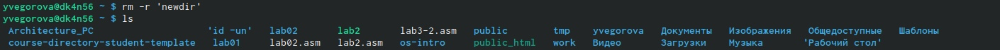
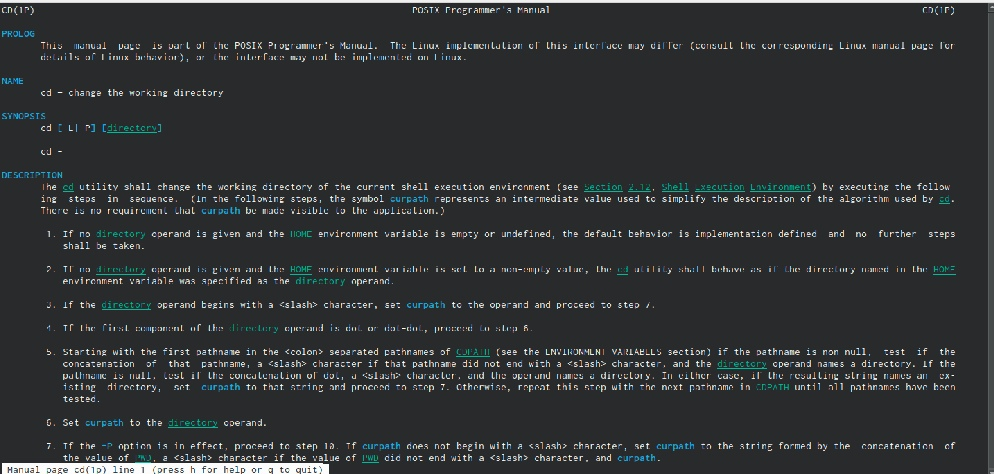

---
## Front matter
title: "Отчёт по лабораторной работе №4 "
subtitle: "дисциплина: Операционные системы"
author: "Егорова Юлия Владимировна"

## Generic otions
lang: ru-RU

## Pdf output format
toc-depth: 2
fontsize: 12pt
linestretch: 1.5
papersize: a4
documentclass: scrreprt
## I18n polyglossia
polyglossia-lang:
  name: russian
  options:
	- spelling=modern
	- babelshorthands=true
polyglossia-otherlangs:
  name: english
## I18n babel
babel-lang: russian
babel-otherlangs: english
## Fonts
mainfont: PT Serif
romanfont: PT Serif
sansfont: PT Sans
monofont: PT Mono
mainfontoptions: Ligatures=TeX
romanfontoptions: Ligatures=TeX
sansfontoptions: Ligatures=TeX,Scale=MatchLowercase
monofontoptions: Scale=MatchLowercase,Scale=0.9
## Biblatex
biblatex: true
biblio-style: "gost-numeric"
biblatexoptions:
  - parentracker=true
  - backend=biber
  - hyperref=auto
  - language=auto
  - autolang=other*
  - citestyle=gost-numeric
## Pandoc-crossref LaTeX customization
figureTitle: "Рис."
tableTitle: "Таблица"
listingTitle: "Листинг"
lofTitle: "Список иллюстраций"
lolTitle: "Листинги"
## Misc options
indent: true
header-includes:
  - \usepackage{indentfirst}
  - \usepackage{float} # keep figures where there are in the text
  - \floatplacement{figure}{H} # keep figures where there are in the text
---

# Цель работы

Приобретение практических навыков взаимодействия пользователя с системой посредством командной строки.

# Выполнение лабораторной работы

1. Я определила полное имя своего домашнего каталога.

{ #fig:001 width=70% }

2. 1. Перешла в каталог /tmp. 

{ #fig:002 width=70% }

3. Вывела на экран содержимое каталога /tmp, используя команду ls с различными опциями, но перед этим создала несколько файлов, чтобы мой каталог не был пустым, командой touch:

{ #fig:003 width=70% }

4. Определила, есть ли в каталоге /var/spool подкаталог с именем cron.

{ #fig:003 width=70% }

5. Перешла в свой домашний каталог и вывела на экран его содержимое. 

{ #fig:005 width=70% }

6. Выполнила следующие действия:

 В домашнем каталоге создала новый каталог с именем newdir.

{ #fig:006 width=70% }

7. В каталоге ~/newdir создала новый каталог с именем morefun.

{ #fig:007 width=70% }

8. В домашнем каталоге создайте одной командой три новых каталога с именами letters, memos, misk. Затем удалите эти каталоги одной командой.

{ #fig:008 width=70% }

{ #fig:009 width=70% }

9. Удаляю ранее созданный каталог ~/newdir командой rm. 

{ #fig:010 width=70% }

10. С помощью команды man определила, какую опцию команды ls нужно использовать для просмотра содержимого не только указанного каталога, но и подкаталогов,входящих в него.
А также с помощью команды man определила набор опций команды ls, позволяющий отсортировать по времени последнего изменения выводимый список содержимого каталога
с развёрнутым описанием файлов.Использовала команду man для просмотра описания следующих команд: cd, pwd, mkdir,
rmdir, rm.

{ #fig:011 width=70% }

{ #fig:012 width=70% }

{ #fig:013 width=70% }

{ #fig:014 width=70% }

{ #fig:015 width=70% }

{ #fig:016 width=70% }

{ #fig:017 width=70% }

{ #fig:018 width=70% }

{ #fig:019 width=70% }

{ #fig:020 width=70% }

{ #fig:021 width=70% }

{ #fig:022 width=70% }

11. Используя информацию, полученную при помощи команды history, выполнила модификацию и исполнение нескольких команд из буфера команд.

{ #fig:023 width=70% }

{ #fig:024 width=70% }

#  Выводы

В ходе данной лабораторной работы я приобрела практические навыки взаимодействия пользователя с системой посредством командной строки.

# Контрольные вопросы

1. Команда (командная строка) — это последовательность слов, разделенных пробелами. Первое слово определяет имя команды, которая будет выполняться. Оставшиеся слова, передаются команде в качестве аргументов.

2. Для определения абсолютного пути к текущему каталогу используется команда pwd (print working directory). Пример (абсолютное имя текущего каталога пользователя dharma): Pwd.

3. Можно получить информацию о типах файлов (каталог, исполняемый файл, ссылка), для чего используется ls -F.

4. Вы можете использовать абсолютные или относительные пути. Абсолютные пути указываются от верхнего каталога / (называемого корнем) до указанного каталога.

5. Команда rm используется для удаления файлов и/или каталогов. Если требуется, чтобы выдавался запрос подтверждения на удаление файла, то необходимо использовать опцию i. Чтобы удалить каталог, содержащий файлы, нужно использовать опцию r. Без указания этой опции команда не будет выполняться.

Пример:

• cd

• mkdir abs

• rm abc

• rm: abc is a directory

• rm -r abc

Если каталог пуст, то можно воспользоваться командой rmdir. Если удаляемый каталог содержит файлы, то команда не будет выполнена — нужно использовать rm -r имя_каталога.

6. Файлы, имена которых начинаются с точки, называются скрытыми. Чтобы увидеть имена скрытых файлов, используем опцию a.

7. Команда rm используется для удаления файлов и/или каталогов.

8. Определить, какие команды пользователь выполнил в сеансе работы можно с помощью команды history. При этом может возникнуть проблема, что будет выведен весь список предшествующих команд, то есть и тех, которые выполнялись задолго до сегодняшней работы.

9. Если в заданном контексте встречаются специальные символы (типа «.», «/», «*» и т.д.), надо перед ними поставить символ экранирования \ (обратный слэш).

10. Чтобы вывести на экран подробную информацию о файлах и каталогах, необ- ходимо использовать опцию l. При этом о каждом файле и каталоге будет выведена следующая информация:тип файла, право доступа, число ссылок, владелец, размер, дата последней ревизии, имя файла или каталога.

11. На экран выводится информация: тип файла, права доступа к файлу, количество ссылок на файл, имя владельца, имя группы, размер файла (в байтах), временной штамп и имя файла.

12. Ввести перед какой-то командой man.

13. Оболочка bash поддерживает историю команд, т. е. запоминает введенные ранее команды. Это позволяет вернуться к любой ранее введенной команде, а также использовать отдельные фрагменты команд из истории для ускорения ввода новых команд. 
